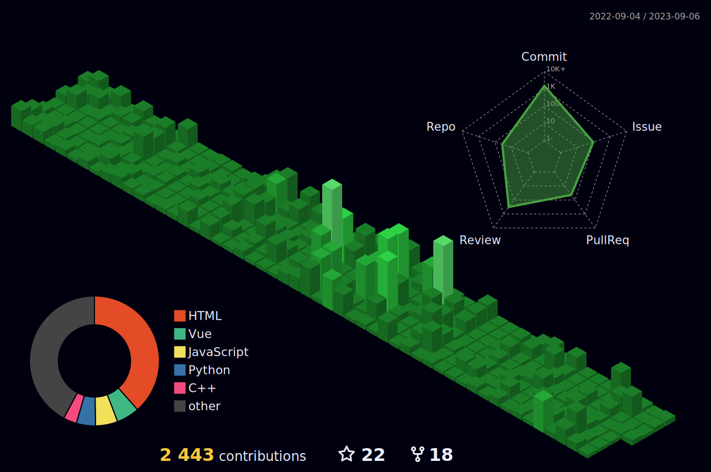

<--
<h3 align="center">
My Tech Stacks
</h3>

<h3 align="center">

</h3>
-->

---

:hammer_and_wrench: Languages and Tools :

  &nbsp;
  &nbsp;
  &nbsp;
  &nbsp;
  &nbsp;
  &nbsp;
  &nbsp;
  &nbsp;
  &nbsp;
  &nbsp;
  &nbsp;
  &nbsp;
  &nbsp;
  &nbsp;
  

### Github Stats:

|  |  |
| :-----------------------------------------------------------------------------------------------------------------------------------------------------------------------------------------------------: | :--------------------------------------------------------------------------------------------------------------------------------------------------------------------------------------: |
|                                                                                      |     |
	  

	

 

  

